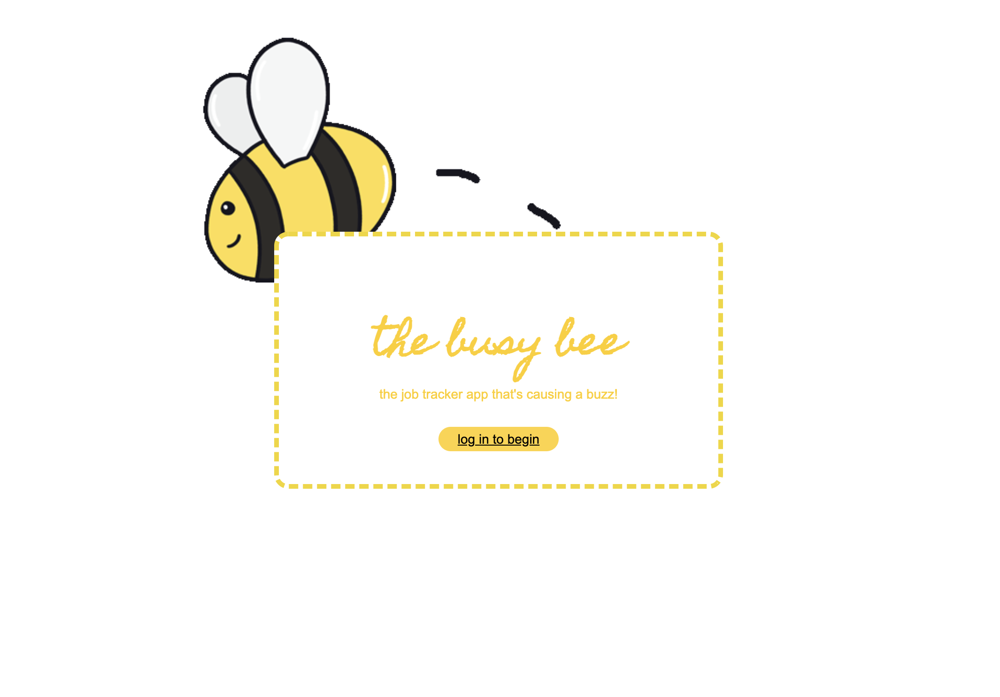
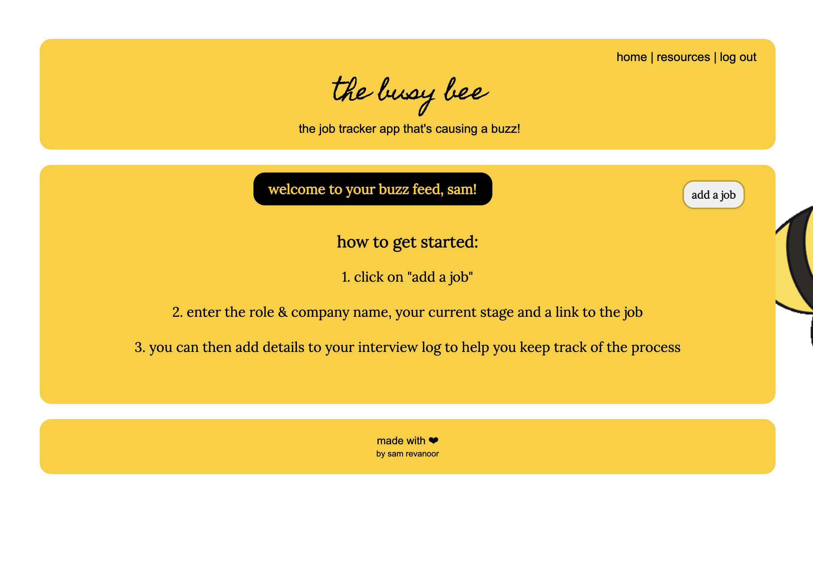
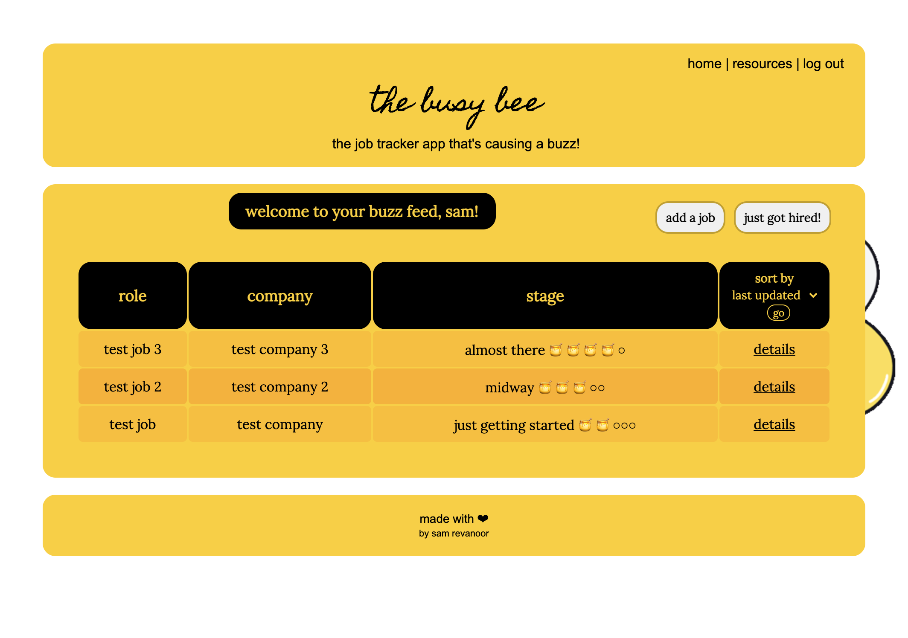
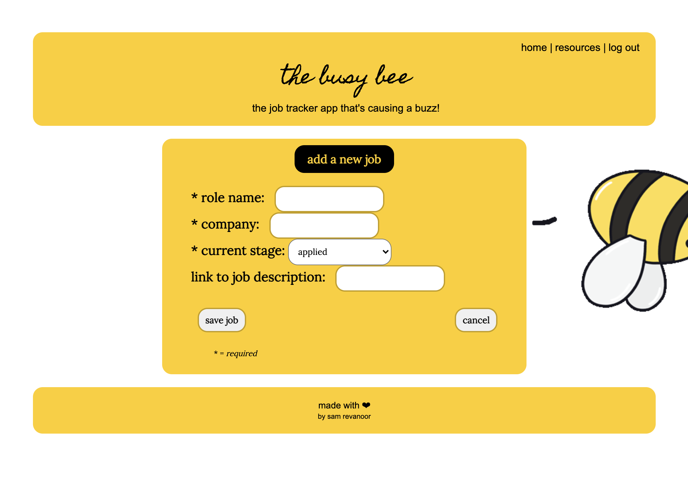
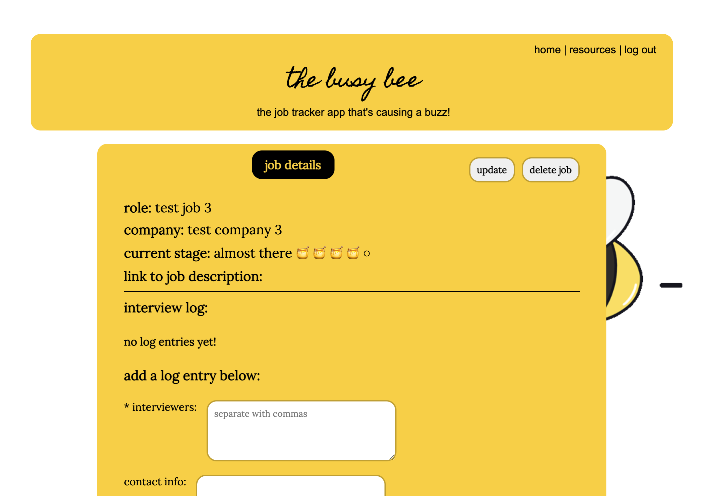
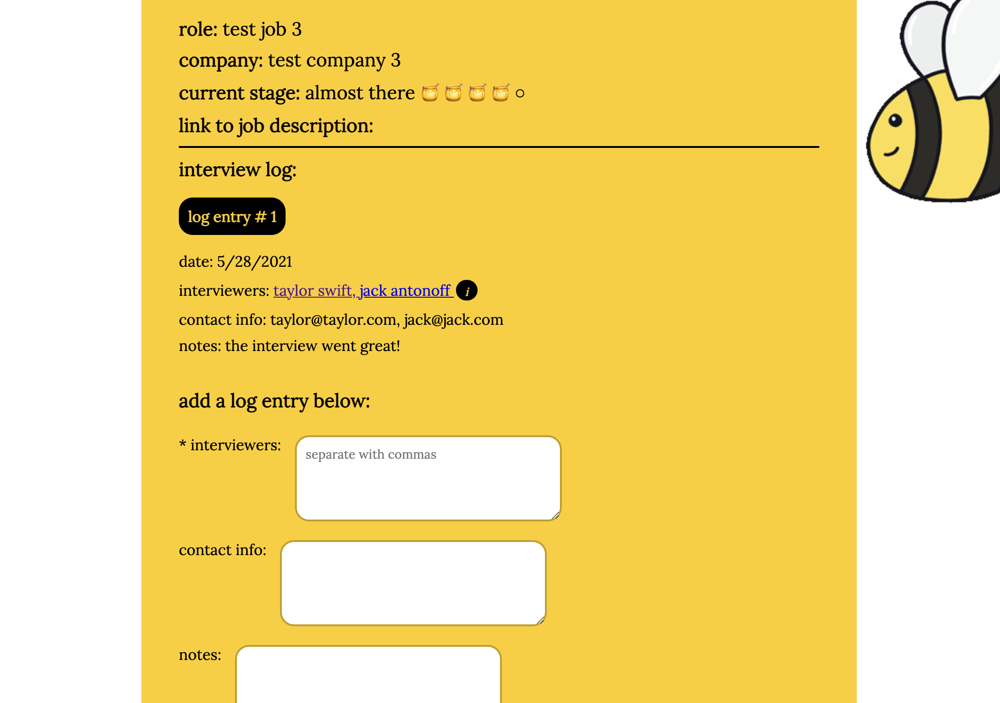
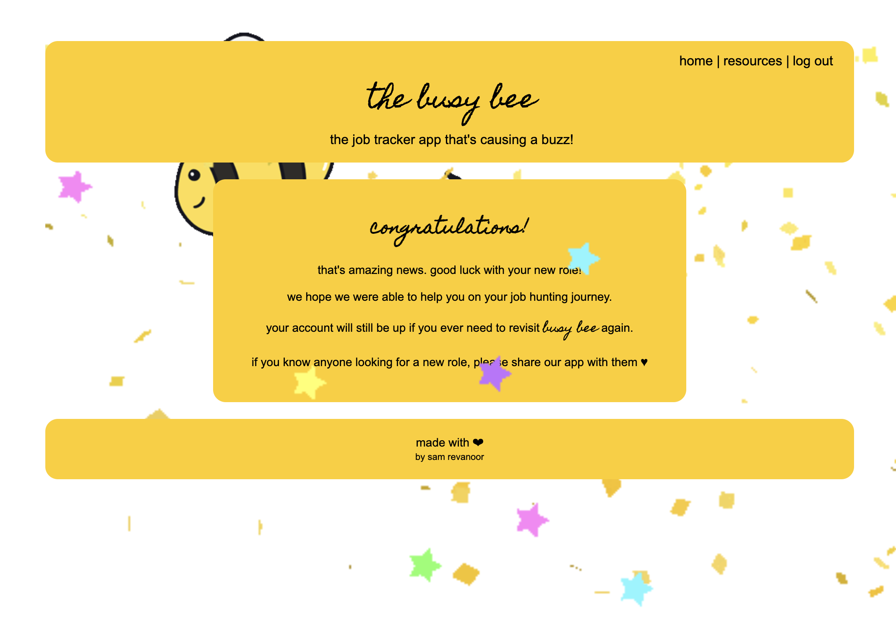
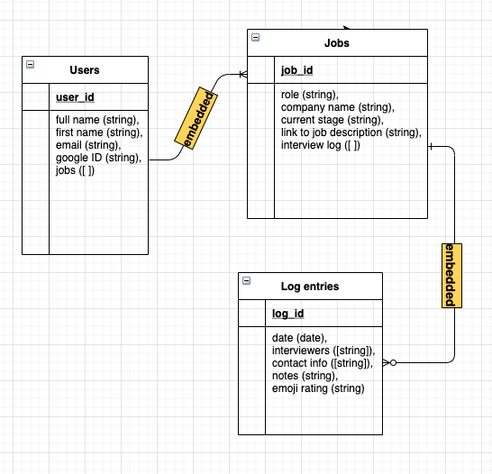

# The Busy Bee Job Tracker App
## by Sam Revanoor

The Busy Bee [web-app](https://thebusybee.herokuapp.com/)

### **Background**

For Project 2, I decided to create a job tracker app with a fun playful twist. Job hunting can be stressful and mentally exhausting but hopefully, with the help of my app, it might add a bit of fun and cheeriness.
 

------

### **Technologies Used**

- HTML
- CSS
- JavaScript
- Node.js
- Express.js
- EJS templates
- MongoDB
- Mongoose
- oAuth
- RESTful routing
- Passport
- Dotenv
 

------

### **Screenshots**

Log In page

 

Home page (with no jobs)

 

Home page (with jobs)

 

Add a job

 

Job details page 

 

Job details page (with interview log entry)

 

Hired page

 

------

### **Getting Started**

You can access my app [here](https://thebusybee.herokuapp.com/), and the repo [here](https://github.com/samrevanoor/busybee).

If you are looking to clone my repo to use my app on your device, make sure to download the following beforehand:
- Mongoose
- Nodemon (optional, but makes it easier)
- Method Override
- Passport
- Dotenv

I used [this Trello board](https://trello.com/b/AglLSD6S/busy-bee-project-board) for my project planning. 

    
Click to expand to view my wireframes.

    Test!

Here is my ERD: 

 

------

### **Next Steps**

- Building out search functionality on the Jobs home page
- Adding a field to enter future interview dates/times for roles
- Sending text messages/email reminders a couple hours before interviews
- Using the Google Maps API to help locate where the interview will be taking place
 

------

Thank you for reading! Enjoy using the app and please share feedback 😊